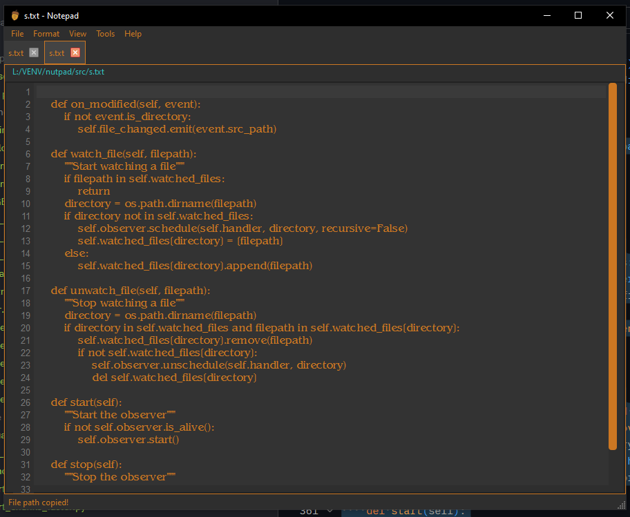

# Nutpad

I use notepad a lot and got so sick of my eyes getting assaulted by it having no dark mode and the lack of tabs, but I also don’t want a bloated notepad app like VS Code just for quick edits. So I made this app.

I aimed to keep it easy on the eyes as well as aesthetically pleasing. It can accept files as arguments (just drag the file to the app or specify the file in the terminal) and it can also accept strings as arguments if you want to automate a few things with it.

## Features

- Dark theme, easy on the eyes
- Tabbed interface for multiple files
- Rich text editor with custom fonts
- Autosave every 30 seconds
- Detects external file changes and prompts reload
- Toggleable line numbers with Ctrl+L shortcut
- Zoom font size via Ctrl + mouse wheel
- File path bar below tabs — click to copy path
- Notifications for file changes and clipboard actions
- Keyboard shortcuts for common actions (New, Open, Save, Exit, etc.)
- Minimal and fast — no bloated features

## Usage

- Open files via drag-and-drop, command line args, or File > Open
- Save files normally or use CTRL + S
- Toggle line numbers with Ctrl+L or View menu item
- Zoom text size with Ctrl + mouse wheel
- Click on file path below tab to copy path to clipboard
- External changes detected with reload prompt
- Settings for fonts and colors in menus
- Autosaves your work in temp folder

## Screenshot

## License

MIT License